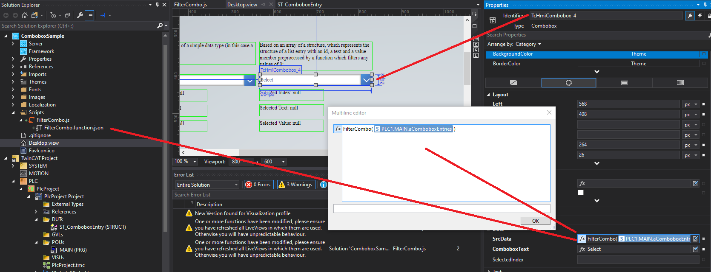

# Example TcHmi Adding Filter to Dynamic Combobox

## Disclaimer
This is a personal guide not a peer reviewed journal or a sponsored publication. We make
no representations as to accuracy, completeness, correctness, suitability, or validity of any
information and will not be liable for any errors, omissions, or delays in this information or any
losses injuries, or damages arising from its display or use. All information is provided on an as
is basis. It is the reader’s responsibility to verify their own facts.

The views and opinions expressed in this guide are those of the authors and do not
necessarily reflect the official policy or position of any other agency, organization, employer or
company. Assumptions made in the analysis are not reflective of the position of any entity
other than the author(s) and, since we are critically thinking human beings, these views are
always subject to change, revision, and rethinking at any time. Please do not hold us to them
in perpetuity.

## Overview
Super simple worked example of using a javascript function to filter an array before giving it to the combobox. 

The parts modified are here


The Javascript code is here
```javascript
(function (TcHmi) {

    var FilterCombo = function (data) {

        console.log(data); // just to show what is being passed in.     

        function isGreaterThanZero(element) {
            return element.value > 0;
        }

        return data.filter(isGreaterThanZero);

    };
    
    TcHmi.Functions.registerFunction('FilterCombo', FilterCombo);
})(TcHmi);
```

The PLC code was modified to contain 8 elements with the last 3 using zero as the value. 

## Install 
Not required.  Simply open the project.

## TwinCAT
This project uses TcXaeShell 3.1.4024.10 and TwinCAT HMI 1.10.1336.404

## Getting started
This is not a guide for TcXaeShell, please visit http://beckhoff.com/ for further guides
